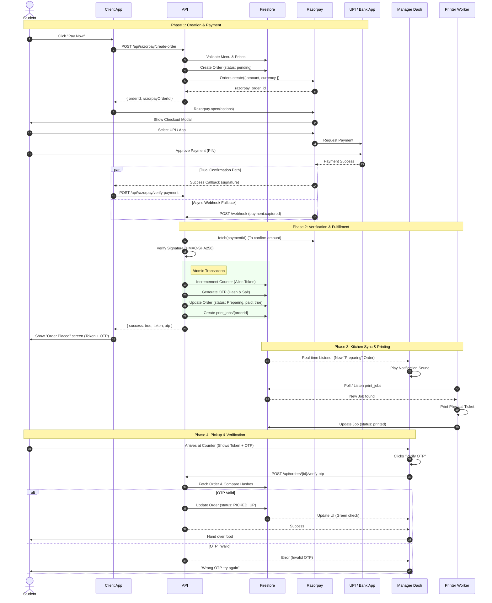

# Complete Order Lifecycle Flow

> Detailed sequence from user action to physical fulfillment.

## System Actors
- **Student**: End user with mobile device
- **Client App**: Next.js Frontend
- **API**: Next.js Server Actions / API Routes
- **Firestore**: Database & Real-time Sync
- **Razorpay**: Payment Gateway
- **UPI / Bank**: External Payment Provider (GPay, PhonePe, etc.)
- **Manager**: Kitchen Staff Dashboard
- **Printer**: Print Queue Worker

---

## 1. Sequence Diagram

---

## 2. Key Process Details

### A. Token Allocation (Atomic)
To prevent duplicates when two students pay simultaneously:
1. **Transaction Start**
2. Read `order_counters/{date}`
3. `nextToken = current + 1`
4. Write new counter & Update Order with `token`
5. **Transaction Commit**
If any step fails (concurrency), the transaction retries automatically.

### B. Webhook vs Client Verification
We handle **both**:
1. **Client Verification**: Fast, immediate feedback for the user.
2. **Webhook**: Failsafe. If user interaction fails (browser closed, network lost after payment), the webhook ensures the order triggers the kitchen.
   - Idempotency logic ensures we don't process the same order twice.

### C. Kitchen Sync
The Manager Dashboard uses `onSnapshot` (Firestore real-time listener).
- **Latency**: < 1 second usually.
- **Reliability**: If dashboard goes offline and reconnects, it auto-syncs state.

### D. OTP Security
- **Generation**: Random 6-digit number.
- **Storage**: NEVER stored as plain text. Only `SHA256(otp + salt)` is in DB.
- **Verification**: Input OTP is hashed with stored salt and compared.
- **Expiry**: 30 minutes or 5 failed attempts.
