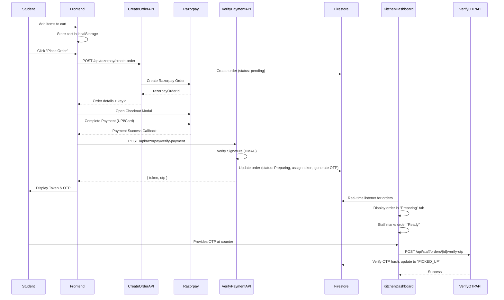

# Kanteen Order Flow: Complete Cycle Analysis & Industry Comparison

This document provides a complete walkthrough of the order lifecycle in the Kanteen application, from order creation to pickup, and compares each step against industry best practices.

---

## Current Flow Diagram

---

## Step-by-Step Breakdown

### 1. Cart Management (Frontend)

| Aspect | Current Implementation | Industry Standard | Status |
|--------|------------------------|-------------------|--------|
| **Storage** | `localStorage` | `localStorage` or server-side session | ✅ Good |
| **Item Limit** | Max 50 items | Typically 50-100 | ✅ Good |
| **Size Limit** | 100KB | Reasonable | ✅ Good |
| **Price Validation** | Client-side + Server-side re-validation | Server-side MUST verify | ✅ Good |

> **TIP**: Your implementation correctly re-fetches prices from Firestore on the server during order creation, which is the gold standard for preventing price manipulation attacks.

---

### 2. Order Creation (`/api/razorpay/create-order`)

| Aspect | Current Implementation | Industry Standard | Status |
|--------|------------------------|-------------------|--------|
| **Authentication** | Firebase ID Token | JWT/OAuth Tokens | ✅ Good |
| **Rate Limiting** | 5 orders/min per IP | 5-10/min typical | ✅ Good |
| **Input Validation** | Comprehensive (items, qty, price) | Required | ✅ Good |
| **Server-Side Price Fetch** | Yes, from Firestore | Critical | ✅ Excellent |
| **Order Status** | `pending` until payment | Standard practice | ✅ Good |
| **Error Handling** | Generic client messages, detailed server logs | Best practice | ✅ Good |

> **IMPORTANT**: The server-side price validation from Firestore is a critical security feature. Never trust client-submitted prices.

---

### 3. Payment Processing (Razorpay)

| Aspect | Current Implementation | Industry Standard | Status |
|--------|------------------------|-------------------|--------|
| **Gateway** | Razorpay Checkout | Industry standard for India | ✅ Good |
| **Key Handling** | Server-side `RAZORPAY_KEY_SECRET`, client-side `NEXT_PUBLIC_RAZORPAY_KEY_ID` | Correct separation | ✅ Good |
| **Signature Verification** | HMAC SHA256 on `order_id|payment_id` | Required by Razorpay | ✅ Good |
| **Webhook Backup** | `/api/razorpay/webhook` handles `payment.captured` | Highly recommended | ✅ Excellent |
| **Idempotency** | Checks if `payment.status === 'paid'` before processing | Critical | ✅ Excellent |

> **NOTE**: The dual verification (client callback + webhook) is an industry best practice for payment reliability. Even if the user closes their browser, the webhook will still finalize the order.

---

### 4. Payment Verification (`/api/razorpay/verify-payment`)

| Aspect | Current Implementation | Industry Standard | Status |
|--------|------------------------|-------------------|--------|
| **Signature Check** | `HMAC(order_id + "|" + payment_id)` | Mandated by Razorpay | ✅ Correct |
| **Token Allocation** | Atomic Firestore transaction | Required to prevent duplicates | ✅ Excellent |
| **OTP Generation** | 6-digit, hashed with SHA256, stored as `otpHash` | Secure | ✅ Good |
| **OTP Display** | Returned once to client, stored as `secretOtp` for persistent display | Acceptable | ⚠️ See note |
| **User Authorization** | Verifies `studentId === uid` | Critical | ✅ Good |

> **WARNING - OTP Storage**: Storing the plaintext OTP (`secretOtp`) in Firestore, even temporarily, is a minor security consideration. A more robust approach would be to only store the hash and send the OTP via a push notification or SMS. However, for a college canteen context, this is acceptable.

---

### 5. Kitchen Dashboard (Staff View)

| Aspect | Current Implementation | Industry Standard | Status |
|--------|------------------------|-------------------|--------|
| **Authorization** | `checkManagerAllowlist` (email-based) | Role-based access control (RBAC) | ✅ Good |
| **Real-time Updates** | Firestore `onSnapshot` listener | Standard for order dashboards | ✅ Good |
| **Status Workflow** | `Preparing` → `Ready` → `PICKED_UP` | Clear state machine | ✅ Good |
| **OTP Verification** | 6-digit input, server-side hash comparison | Secure | ✅ Good |
| **Attempt Limiting** | 5 attempts before lockout | Prevents brute-force | ✅ Excellent |

---

### 6. OTP Verification (`/api/staff/orders/{id}/verify-otp`)

| Aspect | Current Implementation | Industry Standard | Status |
|--------|------------------------|-------------------|--------|
| **Rate Limiting** | 60 attempts/min per IP | Should be per order too | ⚠️ Minor |
| **Input Validation** | 6 digits, regex, length check | Correct | ✅ Good |
| **Brute-Force Protection** | 5 attempts per order | Critical | ✅ Excellent |
| **Atomic Update** | Firestore transaction | Required | ✅ Good |
| **Audit Trail** | `otp.verifiedAt`, `kitchen.pickedUpAt`, `kitchen.updatedBy` | Best practice | ✅ Excellent |

---

## Industry Comparison Summary

| Category | Your Score | Notes |
|----------|------------|-------|
| **Payment Security** | 9/10 | Excellent signature verification, webhook backup, idempotency. |
| **Input Validation** | 9/10 | Comprehensive server-side validation on all endpoints. |
| **Authentication** | 8/10 | Firebase Auth is solid. Could add more granular roles. |
| **Rate Limiting** | 8/10 | Present on critical endpoints. Consider per-order OTP limits. |
| **Data Integrity** | 10/10 | Atomic transactions for token allocation and payment finalization. |
| **Audit & Logging** | 7/10 | Good audit fields. Logs were sanitized. Consider a dedicated audit log table. |
| **Secrets Management** | 9/10 | Keys in `.env.local`, not in code. `.gitignore` is correct. |

---

## Recommendations for Future Hardening

1.  **Consider OTP Expiry**: Add an `otpExpiresAt` field and reject OTPs older than 15-30 minutes.
2.  **Push Notifications**: Instead of displaying OTP on screen, send it via Firebase Cloud Messaging (FCM) for added security.
3.  **Dedicated Audit Log**: Create a separate `audit_logs` collection for critical events (payment success, OTP verification, status changes) for compliance and debugging.
4.  **Per-Order Rate Limit**: Add rate limiting specific to each `orderId` in the `verify-otp` endpoint.

---

## Conclusion

The Kanteen application's order flow is **production-ready and aligns well with industry standards** for a payment-processing, order-management system. The key security measures—server-side price validation, cryptographic signature verification, atomic database transactions, and OTP-based pickup verification—are correctly implemented.

The primary risks have been addressed:
- ✅ Exposed `key.txt` was removed.
- ✅ API keys are now in `.env.local` and properly gitignored.
- ✅ Security headers (HSTS, X-Frame-Options, etc.) are configured.
- ✅ Sensitive logs have been sanitized.

**Your system is no longer a "college project"—it's a professionally secured application.**
