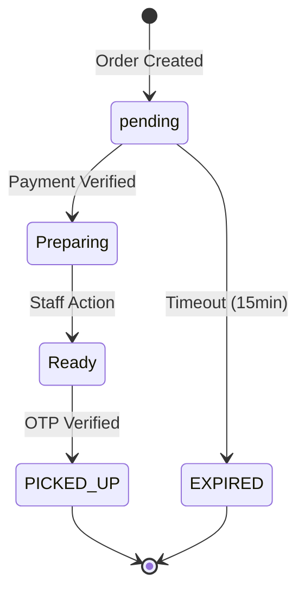

# Order Lifecycle

> Complete order flow from cart to pickup

---

## State Diagram



---

## Lifecycle Phases

### 1. Order Creation

**Trigger:** Student clicks "Place Order"

**Actions:**
1. Server validates items against Firestore prices
2. Order created with status `pending`
3. Razorpay order created
4. Checkout modal opened

**Stored Fields:**
- `studentId`, `items`, `totalPrice`
- `payment.razorpayOrderId`
- `status: 'pending'`

---

### 2. Payment Verification

**Trigger:** Razorpay callback (or webhook backup)

**Actions:**
1. Verify signature (timing-safe)
2. Fetch payment from Razorpay API
3. Verify amount/currency/status
4. Allocate token (atomic)
5. Generate OTP (hashed + salted)
6. Update status to `Preparing`

**Stored Fields:**
- `token` (201-999 for online)
- `otpHash`, `otpSalt`, `otpExpiresAt`
- `payment.status: 'paid'`
- `status: 'Preparing'`

**Returns to Student:**
- Token number
- OTP (shown once, not stored as plaintext)

---

### 3. Kitchen Preparation

**Trigger:** Real-time listener on kitchen dashboard

**Actions:**
1. Order appears in "Preparing" tab
2. Kitchen prepares food
3. Staff marks order as "Ready"

**State Transition:**
```
Preparing → Ready (kitchen_staff)
```

---

### 4. Student Pickup

**Trigger:** Student arrives at counter

**Actions:**
1. Student provides token + OTP
2. Staff enters OTP in dashboard
3. OTP verified against hash
4. Order marked as `PICKED_UP`

**State Transition:**
```
Ready → PICKED_UP (kitchen_staff, OTP required)
```

**Protections:**
- 5 OTP attempts max
- 10-minute lockout after failures
- 30-minute OTP expiry

---

### 5. Regenerate OTP (Optional)

**Trigger:** Student lost OTP

**Endpoint:** `POST /api/orders/{orderId}/regenerate-otp`

**Requirements:**
- Authenticated as order owner
- Order not yet picked up
- Rate limited (5/min)

**Actions:**
1. Generate new OTP
2. Update hash/salt/expiry
3. Clear any lockout
4. Return new OTP once

---

## Token Allocation

### Ranges

| Type | Range |
|------|-------|
| Offline (counter) | 001-200 |
| Online (app) | 201-999 |

### Allocation Logic

1. Atomic Firestore transaction
2. Counter stored in `order_counters/{campus}_{date}`
3. Monotonically incrementing
4. Hard limit at 999 (rejects new orders)

---

## Terminal States

Orders in these states cannot be modified:

- `PICKED_UP` - Successfully completed
- `EXPIRED` - Payment timeout
- `CANCELLED` - Manually cancelled

---

## Audit Trail

All state changes are logged to `audit_logs` collection with:
- Actor ID and role
- Before/after status
- Timestamp
- IP address
