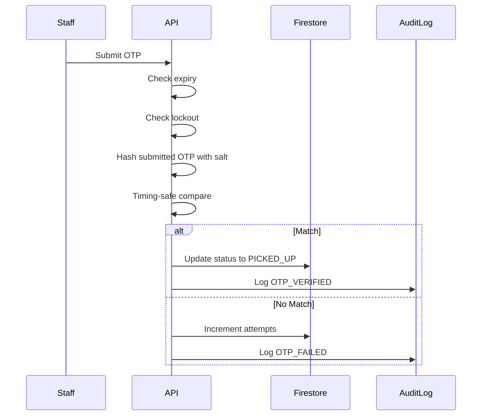

# Kanteen Security Architecture

> **Status:** Production-Ready | **Last Audit:** 2026-02-01

This document describes the security architecture of the Kanteen payment and order fulfillment system.

---

## Security Posture Summary

| Attack Vector | Mitigation | Status |
|---------------|------------|--------|
| Payment replay | Amount/order/currency verification | ✅ Closed |
| Amount tampering | Server-side price fetch from Firestore | ✅ Closed |
| OTP brute-force | 5 attempts + 10-min lockout | ✅ Closed |
| OTP interception | Salted hash only, no plaintext storage | ✅ Closed |
| Timing attacks | `crypto.timingSafeEqual` everywhere | ✅ Closed |
| State skipping | State machine enforcement | ✅ Closed |
| Webhook duplication | Event deduplication via collection | ✅ Closed |
| Privilege escalation | RBAC via Firebase custom claims | ✅ Closed |
| Audit trail gaps | Comprehensive audit logging | ✅ Closed |

---

## Authentication & Authorization

### Layers

1. **Firebase Authentication** - User identity
2. **Firebase Custom Claims** - Role assignment (`student`, `kitchen_staff`, `kitchen_manager`, `admin`)
3. **Firestore Security Rules** - Client-side enforcement
4. **API Route Checks** - Server-side enforcement

### Role Hierarchy

```
admin > kitchen_manager > kitchen_staff > student
```

### Setting Roles

```bash
npx ts-node scripts/set-custom-claims.ts <email> <role>
```

---

## Payment Security

### Razorpay Integration

1. **Order Creation** (`/api/razorpay/create-order`)
   - Server-side price validation from Firestore
   - Order stored as `pending` until payment confirmed

2. **Payment Verification** (`/api/razorpay/verify-payment`)
   - Timing-safe signature verification
   - Fetch payment from Razorpay API to verify:
     - `payment.order_id` matches
     - `payment.amount` matches (in paise)
     - `payment.currency === 'INR'`
     - `payment.status === 'captured'`
   - Atomic token allocation

3. **Webhook Backup** (`/api/razorpay/webhook`)
   - Event deduplication via `webhook_events` collection
   - Same verification as verify-payment
   - Handles browser close / network failure

---

## OTP Security

### Design Principles

- **Hash only** - Only `otpHash` stored in database
- **Salted** - Unique `otpSalt` per order
- **Expiring** - 30-minute expiry via `otpExpiresAt`
- **Lockable** - 10-minute lockout after 5 failed attempts
- **Regenerable** - Students can regenerate if lost

### Verification Flow



---

## State Machine

### Valid Transitions

```
pending → Preparing      (system only, via payment)
pending → EXPIRED        (system only, via cleanup)
Preparing → Ready        (kitchen_staff)
Ready → PICKED_UP        (kitchen_staff, requires OTP)
```

### Terminal States

- `PICKED_UP` - No further transitions
- `EXPIRED` - No further transitions
- `CANCELLED` - No further transitions

### Enforcement Points

1. `src/lib/order-state-machine.ts` - Validation logic
2. `src/app/api/staff/orders/[orderId]/status/route.ts` - API enforcement
3. `firestore.rules` - Field-level restrictions

---

## Audit Logging

### Events Logged

| Event | Trigger |
|-------|---------|
| `PAYMENT_VERIFIED` | Successful payment |
| `PAYMENT_FAILED` | Failed verification |
| `WEBHOOK_PROCESSED` | Webhook handled |
| `WEBHOOK_DUPLICATE` | Duplicate ignored |
| `STATUS_CHANGED` | Order status update |
| `OTP_VERIFIED` | Successful pickup |
| `OTP_FAILED` | Wrong OTP |
| `OTP_REGENERATED` | Student regenerated |
| `OTP_LOCKED` | Max attempts reached |
| `INVALID_TRANSITION` | Blocked state change |
| `AMOUNT_MISMATCH` | Payment tampering attempt |
| `SIGNATURE_INVALID` | Signature verification failed |

### Log Entry Fields

```typescript
{
  eventType: string,
  actorId: string,
  actorRole: string,
  orderId: string,
  ip: string,
  userAgent: string,
  details: object,
  timestamp: Timestamp
}
```

---

## Firestore Security Rules

### Key Protections

1. **Orders** - Staff can only update: `status`, `kitchen`, `otp`, `audit`
2. **Order Counters** - Server-only write
3. **Webhook Events** - Admin read, server write
4. **Audit Logs** - Admin read, server write
5. **Student Profiles** - Owner only

---

## Rate Limiting

| Endpoint | Limit | Scope |
|----------|-------|-------|
| Create Order | 5/min | IP |
| Verify Payment | 10/min | IP |
| Verify OTP | 10/min | IP + Order |
| Status Update | 20/min | IP |
| Regenerate OTP | 5/min | IP |

---

## Recommendations for Future

1. **Orphan Cleanup** - Firebase scheduled function to mark `pending > 15min` as `EXPIRED`
2. **Monitoring** - Alerts for OTP failure spikes, payment mismatches
3. **Load Testing** - Verify token allocation under concurrent load
