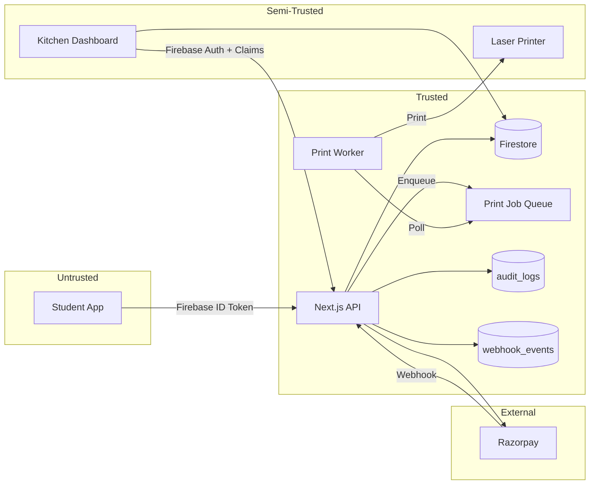

# STRIDE Threat Model

> Kanteen Payment & Order Fulfillment System

---

## System Boundaries

### Entities

| Entity | Trust Level | Description |
|--------|-------------|-------------|
| Student App | Untrusted | Web/mobile client |
| Next.js API | Trusted | Server-side processing |
| Firestore | Trusted | Database with client access via rules |
| Razorpay | External Trusted | Payment gateway |
| Kitchen Dashboard | Semi-Trusted | Staff client with elevated permissions |
| Printer Service | **Semi-Trusted** | Physical device + network hop + driver stack |
| Audit Logs | Trusted | Immutable event log |

### Data Flow Diagram



---

## System Invariants

> These must **always** be true. They become automated test assertions.

### Payment Invariants

| Invariant | Enforcement |
|-----------|-------------|
| Order cannot be `Preparing/Ready/PICKED_UP` unless `payment.status == 'captured'` | State machine + transaction |
| `payment.amount` == `order.totalPrice * 100` forever after confirmation | Immutable after payment |
| One `razorpay_payment_id` maps to exactly one order | Dedupe check in verify-payment |
| Payment signature verified using timing-safe comparison | `crypto.timingSafeEqual` |

### Token Invariants

| Invariant | Enforcement |
|-----------|-------------|
| Token is unique per `{canteenId, YYYYMMDD}` | Atomic counter transaction |
| Token is assigned **once** and never changes | Firestore rules block token writes |
| Token range: 201-999 for online orders | Counter logic + hard limit |

### OTP Invariants

| Invariant | Enforcement |
|-----------|-------------|
| Only `otpHash + salt` exist in DB, never plaintext | OTP returned once, then discarded |
| OTP verification only allowed for `Ready → PICKED_UP` | State machine blocks other paths |
| After 5 failures, verification locked for 10 minutes | `otpLockedUntil` timestamp check |
| OTP expires after 30 minutes | `otpExpiresAt` timestamp check |

### Printer Invariants

| Invariant | Enforcement |
|-----------|-------------|
| Exactly one print job per confirmed order | `jobId = orderId` (Firestore doc ID) |
| Printer outages do not block kitchen queue | Decoupled outbox pattern |
| Reprints are explicit (manual) and audited | `retryDeadLetterJob()` logs event |
| Print payload is minimal (no PII) | Token + items only |

---

## STRIDE Analysis

### S — Spoofing Identity

| Threat | Risk | Mitigation | Test |
|--------|------|------------|------|
| Student impersonates staff | High | Custom claims + server verification | Call staff endpoint as student |
| Staff impersonates admin | Medium | Role hierarchy in claims | Try admin-only actions as staff |
| API request without token | High | `Authorization: Bearer` required | Call endpoints without auth header |
| Forged Firebase token | High | Firebase Admin SDK verifies tokens | Send malformed/expired tokens |

**Status:** ✅ Mitigated

---

### T — Tampering

| Threat | Risk | Mitigation | Test |
|--------|------|------------|------|
| Modify order amount after payment | Critical | Server-side price fetch | Attempt client write to `amount` |
| Skip status transitions | High | State machine enforcement | Try `pending → Ready` |
| Modify `otpHash`/`attempts` | High | Server-only writes | Client write to `otpHash` |
| Reuse payment signature | Critical | Amount/order verification | Replay attack with old signature |
| Double-print same order | Medium | Idempotent print job creation | Trigger print twice |

**Status:** ✅ Mitigated

---

### R — Repudiation

| Threat | Risk | Mitigation | Test |
|--------|------|------------|------|
| "I didn't place that order" | Medium | `audit_logs` with studentId | Check log for ORDER_CREATED |
| "Kitchen marked without OTP" | Medium | OTP_VERIFIED log with actorId | Check log for OTP verification |
| "Payment captured but not confirmed" | High | PAYMENT_VERIFIED + WEBHOOK_PROCESSED | Check dual logging |

**Status:** ✅ Mitigated

---

### I — Information Disclosure

| Threat | Risk | Mitigation | Test |
|--------|------|------------|------|
| Student sees others' orders | Medium | Firestore rules: `studentId == uid` | Read other user's order by ID |
| Student sees others' OTP | High | OTP shown once, only hash stored | Check order doc for plaintext |
| Staff sees cross-campus orders | Low | Canteen-scoped queries | Query orders from other campus |
| Printed ticket reveals PII | Low | Minimal payload (token, items only) | Inspect print payload |

**Status:** ✅ Mitigated

---

### D — Denial of Service

| Threat | Risk | Mitigation | Test |
|--------|------|------------|------|
| OTP brute-force | Medium | 5 attempts + 10-min lockout | 100 sequential OTP attempts |
| Order creation flood | Medium | 5/min rate limit per IP | 50 create-order in 10 seconds |
| Webhook flood | Low | Event deduplication | 100 duplicate webhook events |
| Printer offline | Medium | Job queue + retry + dead letter | Simulate printer down for 10 min |

**Status:** ✅ Mitigated

---

### E — Elevation of Privilege

| Threat | Risk | Mitigation | Test |
|--------|------|------------|------|
| Student becomes staff | Critical | Custom claims set by admin only | Try to set own claims |
| Staff updates forbidden fields | High | Firestore rules: allowlist fields | Write to `amount`, `items` as staff |
| Staff bypasses OTP | High | Server enforces OTP for PICKED_UP | Try status update without OTP |
| Client writes to audit_logs | Medium | Rules: `allow write: if false` | Direct Firestore write |

**Status:** ✅ Mitigated

---

## Printer Service STRIDE (Boundary Addendum)

> Printers are a classic weak link: physical device + LAN + driver stack.

| Category | Threat | Risk | Mitigation |
|----------|--------|------|------------|
| **T** | Print job tampering (wrong items/token) | Medium | Payload hash stored; worker verifies before print |
| **T** | Replay prints (duplicate tickets) | Medium | `jobId = orderId` ensures exactly-once |
| **S** | Attacker prints fake "paid" tickets | High | Only server can create print_jobs |
| **I** | LAN sniffing of print payloads | Low | Minimal payload; consider VLAN isolation |
| **D** | Printer jam/offline blocks system | Medium | Outbox decouples printing from kitchen flow |

### Printer Network Recommendations

1. **Segment printer on separate VLAN** (if multi-tenant canteen)
2. **Disable printer web admin** or password-protect it
3. **Monitor dead-letter queue** for alerts

---

## Attack Surface Summary

```
┌─────────────────────────────────────────────────────────────────┐
│                        ATTACK SURFACE                           │
├─────────────────────────────────────────────────────────────────┤
│  Entry Point          │ Protection          │ Status            │
├───────────────────────┼─────────────────────┼───────────────────┤
│  /api/razorpay/*      │ Auth + Rate limit   │ ✅ Hardened       │
│  /api/staff/*         │ Auth + RBAC         │ ✅ Hardened       │
│  /api/orders/*        │ Auth + Ownership    │ ✅ Hardened       │
│  Firestore (client)   │ Security Rules      │ ✅ Hardened       │
│  Razorpay webhook     │ Signature + Dedupe  │ ✅ Hardened       │
│  Print queue          │ Outbox + Idempotent │ ✅ Implemented    │
│  Printer (LAN)        │ Minimal payload     │ ⚠️ Physical risk │
└───────────────────────┴─────────────────────┴───────────────────┘
```

---

## Recommended Tests

### Priority 1: Must Pass (Invariant Tests)

1. Order cannot reach `Preparing` without `payment.status == 'captured'`
2. Student cannot read other students' orders
3. Student cannot write to `status`, `payment`, `otp*`, `token`
4. Staff cannot write to `items`, `amount`, `studentId`
5. Invalid state transitions are rejected
6. OTP lockout after 5 failures
7. Webhook deduplication works
8. Amount mismatch is rejected
9. Token is unique (no duplicates under concurrency)

### Priority 2: Should Pass (Concurrency Tests)

1. 50 concurrent payments → 50 unique tokens
2. Webhook + verify-payment race → exactly one processes
3. Print job created exactly once per order
4. Printer offline → jobs queue, no lost tickets

### Priority 3: Nice to Have (Operational)

1. Cross-canteen isolation (if multi-campus)
2. Orphan order cleanup (pending > 15min → EXPIRED)
3. Dead-letter monitoring and recovery
